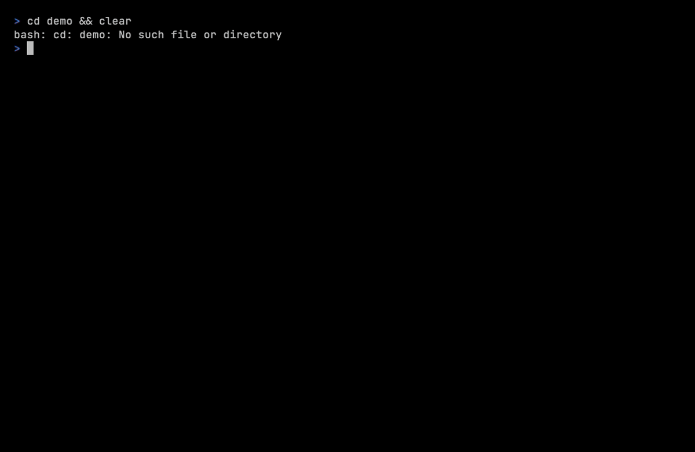

<p align="center">
  
</p>

<h1 align="center">zlrd</h1>

<p align="center">
  <strong>A fast log viewer and observability sidecar for the terminal.</strong><br/>
  Stream, filter, watch — then surface what matters as metrics and alerts.<br/>
  Built in Zig. Single binary. Zero dependencies.
</p>

<p align="center">
  <a href="https://github.com/alaleks/zlrd/releases"></a>
  <a href="https://github.com/alaleks/zlrd/actions/workflows/ci.yml"></a>
  <a href="https://github.com/alaleks/zlrd/actions/workflows/release.yml"></a>
  <a href="https://ziglang.org"></a>
  <a href="LICENSE"></a>
</p>

<p align="center">
  
</p>

---

## Why zlrd

`tail -f | grep | jq` works — until it doesn't. As soon as you need a windowed
error-rate, a `/metrics` endpoint for Prometheus, or a webhook into Slack, you
end up gluing five tools together. `zlrd` collapses that pipeline into a single
static binary:

| You used to run                                              | With `zlrd`                                            |
| ------------------------------------------------------------ | ------------------------------------------------------ |
| `tail -F app.log \| grep -i error`                           | `zlrd -tl error app.log`                               |
| `zcat app.log.gz \| jq 'select(.level=="error")'`            | `zlrd -l error --output json app.log.gz \| jq .`       |
| `awk '/ERROR/{n++} END{print n}'` over a window              | `zlrd --agent --alert-error-rate=10/60s app.log`       |
| logrotate watcher + Slack curl + node_exporter textfile      | `zlrd --agent` with `/metrics` + webhook + alert file  |

It streams files line-by-line in constant memory, auto-detects JSON / bracketed
plain text / logfmt, filters by level/date/regex, and — in **agent mode** —
exposes Prometheus metrics, runs alert rules, and ships notifications to
stderr, files, or HTTP webhooks.

---

## Table of contents

- [Highlights](#highlights)
- [Benchmarks](#benchmarks)
- [Installation](#installation)
- [Reader mode](#reader-mode)
  - [Examples](#reader-examples)
  - [Supported log formats](#supported-log-formats)
  - [Aggregation modes](#aggregation-modes)
- [Agent mode](#agent-mode)
  - [Quick start](#agent-quick-start)
  - [How it fits together](#how-it-fits-together)
  - [HTTP API](#http-api)
  - [Alert rules](#alert-rules)
  - [Alert sinks](#alert-sinks)
  - [Service crash tracking](#service-crash-tracking)
  - [systemd journal sources](#systemd-journal-sources)
  - [Kernel-level probes](#kernel-level-probes)
  - [Webhook integration](#webhook-integration)
  - [Prometheus scrape config](#prometheus-scrape-config)
  - [Production deployment](#production-deployment)
- [CLI reference](#cli-reference)
- [Roadmap](#roadmap)
  - [Status](#status)
  - [Prior art](#prior-art)
- [Contributing](#contributing)
- [License](#license)

---

## Highlights

- **Streaming reader** — line-by-line, constant memory, multi-GB files
- **SIMD-accelerated** parsing of JSON / `[LEVEL]` / `level=` logfmt
- **Filtering** — by level, date range, time-of-day window, regex (with `|` / `&`)
- **Tail mode** — drop-in replacement for `tail -F`
- **Aggregation** — group identical, normalized, or message-keyed lines
- **JSONL output** for clean piping into `jq` and friends
- **Compressed input** — read `.log.gz` directly, no temp files
- **Agent mode** — background watcher with:
  - `/metrics` (Prometheus text + JSON snapshot)
  - error-rate, regex-rate, first-seen and silence alert rules
  - **per-service crash tracking** with stack-trace capture (Go / Python / Java / custom)
  - **stop vs. restart** detection via file inode change and silence windows
  - **systemd-journal** sources (`--journal-unit`) with wildcards
  - **kernel-level probes** (`--kernel-probes`) — OOM, segfault, prior-boot panic; eBPF when `-Dwith-ebpf=true`
  - stderr / JSONL file / HTTP webhook sinks
- **Single static binary** — no runtime, no glibc, no surprises

---

## Benchmarks

Reproduce with `bench/vs-tools.sh` — it generates its own fixtures and prints
every command as it runs. Numbers below: Apple M5, 40.4 MB / 400k lines of
mixed JSON + bracketed + logfmt, best of 5 warm runs.

Two things keep this honest. Output goes to a **file, never `/dev/null`** —
GNU grep checks for `/dev/null` and stops at the first match like `-q`, which
is how the first draft of this table had it at 32 GB/s. And every row reports
the **number of lines the command actually produced**, so a tool that errors
out or matches nothing cannot hide behind a fast time.

**Filtering by level — the thing zlrd is for**

| Tool | Time | Errors found | |
| --- | --- | --- | --- |
| `grep '"level":"error"'` | 29 ms | 22 298 | matches one spelling, in one format |
| `jq 'select(.level=="error")'` | — | **fails** | aborts on the first non-JSON line |
| `zlrd -l error` | 43 ms | **66 787** | reads the level from all three formats |

Three times the errors out of the same file. `grep` only sees the ones written
as JSON; the other two thirds are `[ERROR]` and `level=error`.

**The same task on pure JSONL, where `jq` can compete**

All three emit one JSON object per matching record — 22 298 each, so the work
really is identical.

| Tool | Time | Throughput |
| --- | --- | --- |
| `jq 'select(.level=="error")'` | 267 ms | 79 MB/s |
| `zlrd -l error --output json` | **28 ms** | **757 MB/s** |
| `grep '"level":"error"'` | 23 ms | 922 MB/s (substring, not a parse) |

**Grouping repeated messages** — 17.2 MB, 160 distinct lines; all three report
160 groups.

| Tool | Time | |
| --- | --- | --- |
| `sort \| uniq -c \| sort -rn` | 318 ms | sorts the whole file |
| `awk '{c[$0]++} ...'` | 265 ms | hash table — same algorithm |
| `zlrd -a` | **28 ms** | hashes as it streams |

**Plain substring search** — the case `grep` is built for.

| Tool | Time | |
| --- | --- | --- |
| `ripgrep` | 27 ms | |
| `zlrd -s` | **35 ms** | also parses each line it prints |
| GNU `grep` | 41 ms | |

**Where zlrd is slower**

Reading a `.gz`: `gzcat \| grep` takes 38 ms, `zlrd` 87 ms. The decoder is not
the problem — zlrd's inflate runs about 39 ms against zlib's 34 ms on the same
data. The gap is that the shell pipeline decompresses and searches in two
processes on two cores, while zlrd does both on one thread.

Reading and rendering the whole file: `cat` 20 ms, `zlrd` 48 ms — `cat` does
no parsing, and zlrd formats all 400 000 records.

`ripgrep` is still the right tool when the question is purely about bytes.
zlrd earns its time when the question is about *log structure* — levels, time
windows, repeated messages, crash markers — and it no longer costs you
throughput to ask.

---

## Installation

Two flavours are published for every release:

| Binary        | Size (rel.) | Includes                                            | For you if…                                                              |
| ------------- | ----------- | --------------------------------------------------- | ------------------------------------------------------------------------ |
| **`zlrd`**    | full        | reader **+ agent + sidecar + journal + kernel**     | You want `/metrics`, alerts, webhooks, journal sources, kernel probes    |
| **`zlrd-lite`** | ~60 % smaller | reader only (filter, tail, colorize, aggregate) | You only need a fast `tail`/`grep` replacement in the terminal           |

Both binaries share the reader, so `zlrd-lite app.log` and `zlrd app.log`
behave identically. `zlrd-lite --agent` prints an error pointing at the full
binary instead of silently doing nothing.

### macOS — Homebrew

```bash
# Full binary (reader + agent + sidecar)
brew install alaleks/tap/zlrd

# Lightweight reader-only build
brew install alaleks/tap/zlrd-lite
```

### Linux — apt (Debian, Ubuntu)

```bash
# 1. Prerequisites (skip if you already have curl and gpg)
sudo apt update && sudo apt install -y curl gpg

# 2. Import the registry signing key
curl -fsSL "https://packages.buildkite.com/aleksandr-aleksandrov/zlrd/gpgkey" \
  | sudo gpg --dearmor -o /etc/apt/keyrings/aleksandr-aleksandrov_zlrd-archive-keyring.gpg

# 3. Add the apt source
echo "deb [signed-by=/etc/apt/keyrings/aleksandr-aleksandrov_zlrd-archive-keyring.gpg] https://packages.buildkite.com/aleksandr-aleksandrov/zlrd/any/ any main" \
  | sudo tee /etc/apt/sources.list.d/buildkite-aleksandr-aleksandrov-zlrd.list > /dev/null

# 4. Install one (or both — they don't conflict, different binary names)
sudo apt update && sudo apt install zlrd          # full
sudo apt install zlrd-lite                        # reader-only
```

### Pre-built binaries

Download the archive for your platform from
[Releases](https://github.com/alaleks/zlrd/releases/latest) and put the
binary on your `PATH`.

| Platform              | Full (`zlrd`)                     | Lite (`zlrd-lite`)                     |
| --------------------- | --------------------------------- | -------------------------------------- |
| macOS Apple Silicon   | `zlrd-aarch64-macos.tar.gz`       | `zlrd-lite-aarch64-macos.tar.gz`       |
| macOS Intel           | `zlrd-x86_64-macos.tar.gz`        | `zlrd-lite-x86_64-macos.tar.gz`        |
| Linux x86_64          | `zlrd-x86_64-linux.tar.gz`        | `zlrd-lite-x86_64-linux.tar.gz`        |
| Windows x86_64        | `zlrd-x86_64-windows.zip`         | `zlrd-lite-x86_64-windows.zip`         |

Every release also ships `checksums.txt` with SHA-256 hashes for all
archives and `.deb` packages.

One-liner install on Unix-like systems:

```bash
# macOS Apple Silicon — full
curl -fsSL https://github.com/alaleks/zlrd/releases/latest/download/zlrd-aarch64-macos.tar.gz \
  | tar xz && sudo mv zlrd /usr/local/bin/

# macOS Apple Silicon — lite
curl -fsSL https://github.com/alaleks/zlrd/releases/latest/download/zlrd-lite-aarch64-macos.tar.gz \
  | tar xz && sudo mv zlrd-lite /usr/local/bin/

# Linux x86_64 — full
curl -fsSL https://github.com/alaleks/zlrd/releases/latest/download/zlrd-x86_64-linux.tar.gz \
  | tar xz && sudo mv zlrd /usr/local/bin/

# Linux x86_64 — lite
curl -fsSL https://github.com/alaleks/zlrd/releases/latest/download/zlrd-lite-x86_64-linux.tar.gz \
  | tar xz && sudo mv zlrd-lite /usr/local/bin/
```

### From source

Requires Zig **0.16.0** or later.

```bash
git clone https://github.com/alaleks/zlrd.git
cd zlrd
zig build -Doptimize=ReleaseFast

# Both binaries land in zig-out/bin
sudo install zig-out/bin/zlrd      /usr/local/bin/
sudo install zig-out/bin/zlrd-lite /usr/local/bin/
```

---

## Reader mode

The default mode: read, filter, paginate, follow.

```
zlrd [options] <file...>
```

If no file is passed, `zlrd` reads every `*.log` and `*.log.gz` in the current
directory.

### Reader examples

```bash
# Stream a file with default formatting
zlrd app.log

# Filter by level
zlrd -l error,warn app.log

# Search with OR / AND operators
zlrd -s "connection|timeout" app.log
zlrd -s "error&database"     app.log

# Date range
zlrd -d 2024-01-01..2024-01-31 app.log

# Time window inside one day (incident drill-down)
zlrd -d 2024-01-20 --from 09:00 --to 09:30 app.log

# Real-time follow, errors only
zlrd -t -l error app.log

# Aggregate normalized lines (strips IDs, timestamps, digits)
zlrd -a -m normalized app.log

# Pipe to jq
zlrd --output json app.log | jq 'select(.level == "error")'

# Multiple files with combined filters
zlrd -l error -d 2024-01-20 -s "timeout" app.log gateway.log

# GNU-style grouped short flags
zlrd -tl error app.log
```

### Supported log formats

`zlrd` auto-detects the format from the line shape.

**JSON**

```
{"time":"2024-01-20T12:00:00Z","level":"error","message":"connection refused"}
```

**Bracketed plain text**

```
[ERROR] connection refused
```

**logfmt**

```
time=2024-01-20T12:00:00Z level=error msg="connection refused"
```

Recognized level keys: `level`, `severity`, `lvl`. Recognized timestamp keys:
`time`, `timestamp`, `date`.

### Aggregation modes

| Mode             | Groups by                                     | Use case                          |
| ---------------- | --------------------------------------------- | --------------------------------- |
| `exact`          | full line                                     | Count identical lines             |
| `level-message`  | level + extracted message                     | Same message, any timestamp       |
| `json-message`   | JSON `message`/`msg` field only               | Compare message text across runs  |
| `normalized`     | lowercased, digits → `#`, dates → `<date>`    | Find recurring error patterns     |

---

## Agent mode

Agent mode turns `zlrd` into a long-running watcher that you point at one or
more log files. It exposes a Prometheus-compatible `/metrics` endpoint,
evaluates alert rules over a sliding window, and fans alerts out to the sinks
you enable. **Everything is implemented natively in Zig — no Prometheus client
library, no HTTP framework, no third-party deps.**

### Agent quick start

A minimal production-shaped invocation:

```bash
zlrd --agent \
     --metrics-token=$(openssl rand -hex 16) \
     --listen=127.0.0.1:9100 \
     --alert-error-rate=10/60s \
     --alert-stderr \
     /var/log/app.log
```

What this does, step by step:

1. Starts an HTTP server on `127.0.0.1:9100`.
2. Requires `Authorization: Bearer <token>` on `/metrics` and `/metrics.json`.
3. Tails `/var/log/app.log` from its current end (matches `tail -F`).
4. Increments per-level counters for every observed line.
5. Fires an alert when more than 10 `error|fatal|panic` lines occur in any
   60-second window. The alert is printed to stderr as a single-line JSON
   document.

Scrape it:

```bash
curl -s -H "Authorization: Bearer $TOKEN" http://127.0.0.1:9100/metrics | head
```

A richer invocation that uses all the optional features at once:

```bash
zlrd --agent \
     --metrics-token=$(openssl rand -hex 16) \
     --listen=127.0.0.1:9100 \
     --alert-error-rate=10/60s \
     --alert-regex='panic:1/30s' \
     --alert-first-seen \
     --alert-silence=120s \
     --alert-file=/var/log/zlrd/alerts.jsonl \
     --alert-webhook=https://alerts.internal/zlrd/ingest \
     --webhook-header='Authorization: Bearer wh-secret' \
     --service=api=/var/log/api.log \
     --crash-marker='runtime error:' \
     --journal-unit=workers='myapp@*.service' \
     --kernel-probes \
     /var/log/api.log /var/log/gateway.log
```

### How it fits together

```
                  ┌────────────────────────────────────────────┐
                  │                 zlrd --agent               │
                  │                                            │
   log file ───▶  │   watcher    ──▶   rules    ──▶  alert     │  ──▶ stderr
   (tail loop)    │  (per-line)        engine       dispatcher │  ──▶ JSONL file
                  │      │                                     │  ──▶ webhook(s)
                  │      ▼                                     │
                  │   atomic counters (lines / bytes / etc.)   │
                  │      │                                     │
                  │      ▼                                     │
                  │   HTTP server  (/metrics, /metrics.json,   │  ──▶ Prometheus
                  │                 /healthz)                  │      Grafana, etc.
                  └────────────────────────────────────────────┘
```

The watcher runs on the main thread; the HTTP server runs on a dedicated OS
thread. State shared between them is either atomic (counters) or protected by
an `Io.Mutex` (rule state, alert file fd).

### HTTP API

| Method | Path             | Auth   | Returns                                                  |
| ------ | ---------------- | ------ | -------------------------------------------------------- |
| GET    | `/metrics`       | Bearer | Prometheus text exposition (`text/plain; version=0.0.4`) |
| GET    | `/metrics.json`  | Bearer | JSON snapshot of all counters                            |
| GET    | `/healthz`       | none   | `ok` (200)                                               |

Auth is enforced with a **constant-time comparison** against the configured
token. Any non-matching token returns `401 Unauthorized` without leaking
timing information. Requests without an `Authorization: Bearer ...` header
also receive `401`.

Exposed metrics:

| Name                          | Type    | Labels                | Description                                |
| ----------------------------- | ------- | --------------------- | ------------------------------------------ |
| `zlrd_up`                     | gauge   | —                     | Always `1` while the process is healthy    |
| `zlrd_uptime_seconds`         | gauge   | —                     | Seconds since the agent started            |
| `zlrd_files_watched`          | gauge   | —                     | Number of files currently followed         |
| `zlrd_lines_total`            | counter | `level`               | Lines observed, bucketed by detected level |
| `zlrd_bytes_total`            | counter | —                     | Total bytes of log content read            |
| `zlrd_alerts_fired_total`     | counter | `rule`                | Alerts emitted, by rule kind               |
| `zlrd_http_requests_total`    | counter | `route`, `code`       | Metrics endpoint hits                      |
| `zlrd_file_rotation_total`    | counter | —                     | File truncations / rotations detected      |

`level` label values: `trace`, `debug`, `info`, `warn`, `error`, `fatal`,
`panic`, `unknown`. `rule` values: `error_rate`, `regex`, `first_seen`,
`silence`.

### Alert rules

Rules are independent and may be combined freely. Each one is windowed and
**latches per epoch** — a single burst only fires one alert per window, not
one per line.

#### `--alert-error-rate <N/Ws>` — error spike

Fire when more than **N** `error|fatal|panic` lines arrive within the last
**W** seconds (or `ms`, `m`, `h`).

```bash
--alert-error-rate=10/60s      # 10 errors in a minute
--alert-error-rate=1/500ms     # any error spike over 2 rps
--alert-error-rate=50/5m       # 50 errors in 5 minutes
```

#### `--alert-regex <pattern>:<N/Ws>` — pattern hit-rate

Reuses the built-in regex engine. Repeatable for multiple patterns.

```bash
--alert-regex='panic:1/30s'                 # one panic in 30s
--alert-regex='OOMKilled:1/5m'              # OOMs are always interesting
--alert-regex='5\d\d HTTP:50/60s'           # 5xx burst
```

The colon **before the threshold** is the last one in the spec, so patterns
may themselves contain `:` (e.g. `level:error:3/60s`).

#### `--alert-first-seen` — novel error signatures

Fire the first time we see an error/fatal/panic line whose **normalized
signature** has not been observed before. Normalization lowercases the line,
collapses runs of digits to `#`, and collapses long hex runs (UUIDs, request
IDs) to `<id>`. So:

```
connection refused to 10.0.0.1:5432 in 1500ms
connection refused to 10.0.0.7:5400 in 2200ms
```

…hash to the **same signature** and only alert once. A completely new
message — `permission denied`, say — fires again.

The seen-set lives in process memory; restarting the agent clears it.

#### `--alert-silence <Ws>` — heartbeat / dead-shipper

Fire when **no line** has arrived in any watched file for **W** seconds.
Useful for catching stuck processes or broken log shippers — the kind of
outage that other monitors miss because there's literally nothing to monitor.

```bash
--alert-silence=120s    # alert if log goes quiet for 2 minutes
```

### Alert sinks

A single alert can fan out to any combination of sinks. Each fired rule
produces one JSON payload that's pushed to all enabled sinks.

| Flag                     | Sink                       | Behavior                                                          |
| ------------------------ | -------------------------- | ----------------------------------------------------------------- |
| `--alert-stderr`         | stderr                     | One JSON document per line. Pipes cleanly into systemd journal.   |
| `--alert-file <path>`    | append-only JSONL          | Opened with append semantics; safe across rotations.              |
| `--alert-webhook <url>`  | HTTP POST                  | `Content-Type: application/json`. Repeatable for fan-out.         |
| `--webhook-header <K:V>` | extra header on every POST | Use for `Authorization`, signing, or custom routing. Repeatable.  |
| `--alert-exit`           | process exits non-zero     | Useful in CI / one-shot use cases. Combines with other sinks.     |

If no sink is configured, agent mode defaults to **stderr** so an alert is
never silently swallowed.

#### Alert payload schema

```json
{
  "ts_ms":          1781458814344,
  "kind":           "error_rate",
  "rule_id":        "error_rate",
  "file":           "/var/log/app.log",
  "threshold":      { "count": 10, "window_ms": 60000 },
  "observed_count": 12,
  "line":           "{\"level\":\"error\",\"msg\":\"boom\"}"
}
```

| Field            | Notes                                                                  |
| ---------------- | ---------------------------------------------------------------------- |
| `ts_ms`          | Wall-clock milliseconds (UTC) when the rule fired                      |
| `kind`           | `error_rate` · `regex` · `first_seen` · `silence`                      |
| `rule_id`        | For `regex`, the pattern that matched; otherwise the rule name         |
| `file`           | Source file that produced the trigger line                             |
| `threshold`      | The configured `{count, window_ms}` of the rule                        |
| `observed_count` | How many events were in the window when the rule latched              |
| `line`           | The triggering log line (omitted for `silence`)                        |

### Service crash tracking

`zlrd` can monitor named services for **abnormal termination** — panics,
fatals, unhandled exceptions — and surface them with a captured **stack
trace** and a tally of how often a given service has died and restarted.

Bind a service to a log file path:

```bash
zlrd --agent --metrics-token=$TOKEN \
     --service=api=/var/log/api.log \
     --service=worker=/var/log/worker.log \
     /var/log/api.log /var/log/worker.log
```

#### What counts as a crash

A crash fires when a log line matches any of the built-in markers below.
You can also add custom regex patterns with `--crash-marker '<regex>'`
(repeatable; extends the built-in set):

| Language / shape  | Marker pattern                                |
| ----------------- | --------------------------------------------- |
| Go — panic        | `panic: `                                     |
| Go — runtime throw | `fatal error: `, `runtime: out of memory`, `[signal SIG…]` |
| Rust              | `thread '…' panicked at ` (both the current and pre-1.72 spellings) |
| Python            | `Traceback (most recent call last):`          |
| Java / Kotlin     | `Exception in thread `                        |
| C / C++ / glibc   | `terminate called `, `*** stack smashing detected ***`, `double free or corruption`, `free(): invalid pointer`, `malloc(): corrupted top size` |
| Reaped by the shell | `Segmentation fault (core dumped)`, `Aborted (core dumped)` |
| JSON / logfmt     | detected `level=fatal` or `level=panic`       |
| User-defined      | `--crash-marker '<regex>'`                    |

A marker only counts when it **starts the line**, or starts the message part
of a captured line whose envelope ends in `:`, `]` or `|` — so
`unit[7]: panic: boom` is a crash and `GET /api/panic: status`,
`no panic: all good` and `"panic: 0 restarts: 0"` are not. A line that carries
its own level below `error` is never a crash either, however runtime-looking
its text: `{"level":"info","msg":"recovered from panic: …"}` came out of a
logger, not out of a dying process. Custom `--crash-marker` patterns are
exempt from that last rule — you asked for them explicitly.

#### Stack-trace capture

After a marker is detected, `zlrd` keeps reading subsequent lines and appends
them to the trace until the continuation heuristic breaks (next "normal" log
entry, blank line, byte/line cap). Captured into a fixed 4 KiB / 32-line
buffer per service — **zero per-line heap activity**.

Heuristic for "trace continuation":
- starts with a tab or two+ spaces (Java / Python / Go indent)
- starts with `goroutine ` / `[signal ` (Go)
- starts with `Caused by:` (Java)
- starts with `0x` (raw backtrace)
- one leading blank line is tolerated (Go's `panic:` → blank → `goroutine`)

#### Stop vs. restart

`zlrd` distinguishes service termination from process recycling using
**file-level signals only** (no PID guessing, no kernel hooks needed):

- **`service_restart`** — the file's **inode changed** under the path
  (logrotate, `mv old new`, `rm + recreate`, container restart writing to
  a new log file). Resets the tracker's in-flight crash collection.
- **`service_stop`** — after a crash event, the log goes silent for the
  configured stop window (30 s default). Indicates the process died and
  was not respawned.
- **`service_crash`** — a marker matched. Includes stack trace and PID
  if discoverable from the trigger line.

#### Alert payload (service events)

```json
{
  "ts_ms": 1781552666549,
  "kind": "service_crash",
  "service": "api",
  "file": "/var/log/api.log",
  "marker": "go_panic",
  "pid": 1234,
  "crash_count": 1,
  "restart_count": 0,
  "detail": "panic: nil pointer dereference",
  "stack_trace": "goroutine 1 [running]:\n\tmain.crash(0x0)\n\t\t/app/main.go:42\n\tmain.main()\n"
}
```

| Field           | Notes                                                                          |
| --------------- | ------------------------------------------------------------------------------ |
| `kind`          | `service_crash` · `service_stop` · `service_restart`                           |
| `marker`        | `go_panic` · `go_fatal` · `rust_panic` · `python_traceback` · `java_exception` · `native_abort` · `fatal_level` · `panic_level` · `custom_regex` · `systemd_signal` |
| `pid`           | Parsed from `"pid":N`, `pid=N`, or `[N]:` if present in the trigger line       |
| `crash_count`   | Cumulative crashes seen for this service since agent start                     |
| `restart_count` | Cumulative restarts (inode changes) seen for this service                      |
| `stack_trace`   | Captured continuation lines (omitted for `stop` / `restart`)                   |

### systemd journal sources

On modern Linux, most services no longer write to flat log files — their
stdout/stderr is captured by **journald**. Point `zlrd` at a unit (or a
glob) and it streams the journal directly:

```bash
zlrd --agent --metrics-token=$TOKEN \
     --journal-unit=api='myapp.service' \
     --journal-unit=workers='myapp@*.service'
```

How it works: one `journalctl -fu '<pattern>' --output=json --no-pager
--since now` subprocess per `--journal-unit`. Each entry is parsed and
classified:

| Source of message               | What `zlrd` does                                |
| ------------------------------- | ----------------------------------------------- |
| App-level `panic:` / `Traceback` / `level=fatal` in `MESSAGE` | Routed to the per-unit crash tracker (same as file-backed services) |
| systemd lifecycle (`Started`, `Stopped`, `Stopping`, `Reloading`, `Deactivated`) | **Silently dropped** — systemd already owns lifecycle; surfacing it is noise |
| systemd crash signal (`Main process exited, code=killed/dumped`, `Failed with result 'signal' / 'core-dump' / 'oom-kill' / 'watchdog'`) | Fires `service_crash` with `marker=systemd_signal` |

**Wildcards** (`myapp@*.service`) are passed verbatim to `journalctl -u`,
which expands them natively. Inside the source `zlrd` keeps a per-unit
tracker (capped at 256 distinct unit instances) so each running instance
gets its own crash/stack-trace accounting.

Journal sources **do not emit `service_stop` or `service_restart`** —
systemd already tracks unit liveness and the user (you) explicitly asked
for crashes only. The `file` field in the payload uses a pseudo-path:

```json
{
  "kind": "service_crash",
  "service": "workers",
  "file": "journal://myapp@worker1.service",
  "marker": "systemd_signal",
  "pid": 5678,
  "detail": "Main process exited, code=killed, status=11/SEGV"
}
```

**Dedup**: if the application logged a panic right before systemd noticed
the unit died, `zlrd` suppresses the systemd-side `service_crash` for that
unit — the app-level event already captured the trace.

The agent runs with `--journal-unit` alone — no positional log files
required. Requires Linux with systemd; on macOS/Windows the source logs
a one-line "unsupported" notice and stays idle.

### Kernel-level probes

`--kernel-probes` enables a Linux-only **kernel event monitor** that
surfaces OOM kills, segfaults, and prior-boot kernel panics as alerts.
Three backends layered for accuracy vs. portability:

| Backend  | What it catches                                       | Requirements                                  |
| -------- | ----------------------------------------------------- | --------------------------------------------- |
| `pstore` | **Prior-boot kernel panic** — scans `/sys/fs/pstore/` and the `TAINT_DIE` bit of `/proc/sys/kernel/tainted` at agent startup | Linux, pstore enabled                         |
| `kmsg`   | **OOM** (always-on), **segfault** (when `kernel.print-fatal-signals=1`) | Linux, read access to `/dev/kmsg` (CAP_SYSLOG or `adm` group) |
| `ebpf`   | **OOM** via tracepoint `oom:mark_victim`; segfault tracepoint coming next | Linux ≥ 5.8, CAP_BPF + CAP_PERFMON, `zig build -Dwith-ebpf=true` |

```bash
# Stock build (kmsg + pstore)
zlrd --agent --metrics-token=$TOKEN --kernel-probes /var/log/app.log

# With eBPF backend compiled in
zig build -Doptimize=ReleaseFast -Dwith-ebpf=true
sudo setcap cap_bpf,cap_perfmon,cap_syslog+ep ./zig-out/bin/zlrd
zlrd --agent --metrics-token=$TOKEN --kernel-probes /var/log/app.log
```

Kernel events flow through the same alert sinks (stderr / file / webhook)
as everything else, with a distinct payload kind:

```json
{
  "ts_ms": 1781552666549,
  "kind": "kernel_oom",
  "source": "kmsg",
  "pid": 7421,
  "comm": "myapp",
  "detail": "Killed process 7421 (myapp), UID 1000, total-vm:..."
}
```

**Important**: a running kernel panic is **impossible to catch from
userspace** — the userspace process is dead by definition. The pstore
backend is the only way to detect that a panic happened, and it only
fires once at the agent's next startup after the affected boot.

On non-Linux hosts (`--kernel-probes` on macOS or Windows) the flag is
accepted and the monitor logs a one-line notice that the feature is
unsupported, then stays idle.

### Webhook integration

Webhook delivery is best-effort — failures are logged via `std.log` and the
watcher keeps running. The same payload is POSTed to every URL passed via
`--alert-webhook`.

#### Generic receiver / Alertmanager

For systems that accept arbitrary JSON, the default `Content-Type` works
and auth attaches via `--webhook-header`:

```bash
zlrd --agent --metrics-token=$TOKEN \
     --alert-error-rate=10/60s \
     --alert-regex='panic:1/30s' \
     --alert-webhook="https://alerts.internal/zlrd/ingest" \
     --webhook-header="Authorization: Bearer $WEBHOOK_SECRET" \
     --webhook-header="X-Source: prod-app-1" \
     app.log
```

`--webhook-header` is **repeatable** and applies to **all** configured webhooks.

#### Slack / Discord (templated)

Slack and Discord webhooks expect a specific body shape (`{"text": "..."}`),
so the raw `zlrd` payload won't render as a message. The simplest route is to
front them with a tiny templating proxy that consumes the `zlrd` payload and
emits the channel-specific format. The raw payload itself is stable and
documented in [Alert payload schema](#alert-payload-schema), so the proxy
stays trivial.

### Prometheus scrape config

A working scrape configuration for the metrics endpoint:

```yaml
scrape_configs:
  - job_name: zlrd
    scrape_interval: 15s
    metrics_path: /metrics
    authorization:
      type: Bearer
      credentials: "${ZLRD_METRICS_TOKEN}"
    static_configs:
      - targets: ["app-host-1:9100", "app-host-2:9100"]
```

Pair the counters with `rate()` for actionable alerts in Prometheus itself:

```promql
# Error rate per host, per minute
sum by (instance) (rate(zlrd_lines_total{level=~"error|fatal|panic"}[1m]))

# Did the agent itself fire any alerts in the last 5 minutes?
sum by (rule) (increase(zlrd_alerts_fired_total[5m])) > 0

# Have we seen file rotations recently?
increase(zlrd_file_rotation_total[10m]) > 0
```

### Production deployment

A minimal `systemd` unit for a long-running watcher:

```ini
# /etc/systemd/system/zlrd-agent.service
[Unit]
Description=zlrd log watcher
After=network-online.target
Wants=network-online.target

[Service]
Type=simple
EnvironmentFile=/etc/zlrd/env
ExecStart=/usr/local/bin/zlrd --agent \
  --listen=127.0.0.1:9100 \
  --metrics-token=${ZLRD_METRICS_TOKEN} \
  --alert-error-rate=20/60s \
  --alert-regex=panic:1/30s \
  --alert-first-seen \
  --alert-silence=300s \
  --alert-file=/var/log/zlrd/alerts.jsonl \
  --alert-webhook=${ZLRD_WEBHOOK_URL} \
  --webhook-header=Authorization:\ Bearer\ ${ZLRD_WEBHOOK_TOKEN} \
  /var/log/app.log /var/log/gateway.log
Restart=on-failure
RestartSec=5s
NoNewPrivileges=true
ProtectSystem=strict
ReadWritePaths=/var/log/zlrd
DynamicUser=true

[Install]
WantedBy=multi-user.target
```

Tips:

- Bind to `127.0.0.1` and front it with the existing scrape proxy / mesh — no
  need to expose `9100` publicly.
- Generate the token once, persist it to `/etc/zlrd/env` with mode `0400`,
  and feed it to both the agent and the scrape config.
- Send the JSONL alert log to your existing log pipeline; it pairs nicely
  with `zlrd` itself (`zlrd --output json /var/log/zlrd/alerts.jsonl`).

---

## CLI reference

### Reader options

| Flag                          | Value      | Description                                                         |
| ----------------------------- | ---------- | ------------------------------------------------------------------- |
| `-f, --file`                  | `<path>`   | Log file (repeatable)                                               |
| `-s, --search`                | `<text>`   | Search expression; `\|` = OR, `&` = AND                             |
| `-l, --level`                 | `<list>`   | Comma-separated levels; repeatable                                  |
| `-d, --date`                  | `<date>`   | `YYYY-MM-DD` or `YYYY-MM-DD..YYYY-MM-DD`                            |
| `    --from`                  | `<time>`   | Time range start (`HH:MM` or `HH:MM:SS`)                            |
| `    --to`                    | `<time>`   | Time range end                                                      |
| `    --output`                | `<mode>`   | Output mode: `json` (JSONL)                                         |
| `-t, --tail`                  |            | Follow file in real time                                            |
| `-n, --num-lines`             | `<num>`    | Paginate N lines per page                                           |
| `-a, --aggregate`             |            | Group identical matched lines                                       |
| `-m, --aggregate-mode`        | `<mode>`   | `exact` · `level-message` · `json-message` · `normalized`           |
| `-v, --version`               |            | Print version and exit                                              |
| `-h, --help`                  |            | Show help                                                           |

### Agent options

| Flag                          | Value      | Description                                                                  |
| ----------------------------- | ---------- | ---------------------------------------------------------------------------- |
| `    --agent`                 |            | Run as a background watcher                                                  |
| `    --listen`                | `<addr>`   | HTTP bind address — default `127.0.0.1:9100`                                 |
| `    --metrics-token`         | `<token>`  | Bearer token (mandatory)                                                     |
| `    --alert-error-rate`      | `<N/Ws>`   | Error spike threshold (e.g. `10/60s`)                                        |
| `    --alert-regex`           | `<spec>`   | `pattern:N/Ws` — repeatable                                                  |
| `    --alert-first-seen`      |            | Alert on novel normalized error signatures                                   |
| `    --alert-silence`         | `<Ws>`     | Heartbeat: alert when no lines arrive in window                              |
| `    --alert-stderr`          |            | Sink: JSON to stderr                                                         |
| `    --alert-file`            | `<path>`   | Sink: append JSONL                                                           |
| `    --alert-webhook`         | `<url>`    | Sink: POST JSON — repeatable                                                 |
| `    --webhook-header`        | `<K: V>`   | Extra header for all webhooks — repeatable                                   |
| `    --alert-exit`            |            | Exit non-zero on first alert                                                 |

### Service / kernel options

| Flag                          | Value          | Description                                                                  |
| ----------------------------- | -------------- | ---------------------------------------------------------------------------- |
| `    --service`               | `<NAME=PATH>`  | Bind a service name to a log file — repeatable                               |
| `    --crash-marker`          | `<regex>`      | Additional crash pattern (extends the built-in set) — repeatable             |
| `    --journal-unit`          | `<NAME=PATTERN>` | Track a systemd unit (glob supported) via `journalctl` — Linux, repeatable |
| `    --kernel-probes`         |                | Enable OOM / segfault / prior-boot panic detection (Linux)                   |

Build-time options:

| Option                        | Default    | Effect                                                                       |
| ----------------------------- | ---------- | ---------------------------------------------------------------------------- |
| `-Dwith-ebpf=true`            | `false`    | Compile in the eBPF kernel-probe backend (Linux only, needs CAP_BPF at runtime) |

Duration suffixes: `ms`, `s`, `m`, `h`.

---

## Roadmap

- [x] Streaming reader with JSON, bracketed, and logfmt detection
- [x] Level, date, and time-range filtering
- [x] Regex search with `|` and `&` operators
- [x] Aggregation modes
- [x] gzip input
- [x] JSONL output for pipelines
- [x] Pre-built binaries for macOS, Linux, Windows
- [x] Homebrew tap and apt repository
- [x] **Agent mode: background watcher, HTTP metrics endpoint, alerting**
- [x] **Per-service crash tracking** with stack-trace capture (Go / Python / Java / custom)
- [x] **systemd-journal sources** (`--journal-unit`) with wildcards
- [x] **Kernel-level probes** — kmsg/pstore baseline, eBPF backend behind `-Dwith-ebpf`
- [x] Sidecar mode: gRPC streaming to a central collector
- [x] Native `sd-journal` reader (drop the `journalctl` subprocess)

Next:

- [ ] Windows event log as a source
- [ ] `--since 5m` relative time filters
- [ ] Structured field filters (`--where status=500`)
- [ ] A schema hint for protobuf payloads, so decoded fields get names

### Status

Used daily by its author against production logs, with a test suite that runs
on Linux, macOS and Windows. The reader interface is stable; agent-mode flags
may still move before 2.0. If something breaks on a log format you have,
[open an issue with the line that broke it](https://github.com/alaleks/zlrd/issues)
— that is how most of the format handling here got written.

### Prior art

`lnav` is the richest terminal log viewer there is, and if you want SQL over
your logs, use it. `angle-grinder` is excellent at aggregation pipelines.
zlrd is smaller than both on purpose: one static binary, no runtime, no
configuration, and the same tool doubles as the metrics endpoint and alert
watcher for the box it is already sitting on.

---

## Contributing

Bug reports and pull requests are welcome — see
[CONTRIBUTING.md](CONTRIBUTING.md) for the build, test and style rules, and
[CLA.md](CLA.md) for the contributor agreement you sign once on your first
pull request.

The short version:

- `zig build test` — all tests must pass; new functionality should ship with tests.
- `zig fmt src/` — keep formatting consistent.
- Follow the existing style: no hidden allocations, explicit error handling,
  small focused functions, `std`-only.

---

## License

[MIT](LICENSE)
